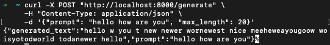
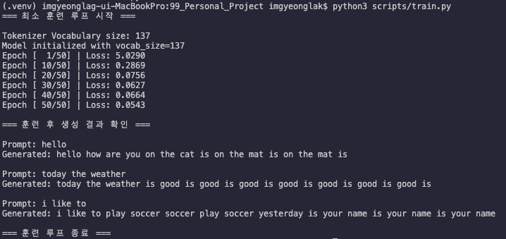
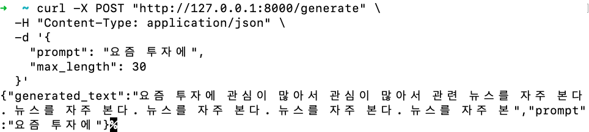

# 05 Chatbot - 단계 5 (완료)

## 현재 단계

- ✅ **단계 1**: FastAPI 기본 구조 + Dummy Generator 완료
- ✅ **단계 2**: 반복 호출 방식의 간이 생성기 완료 (규칙 기반)
- ✅ **단계 3**: PyTorch의 기본 모듈만 사용한 실제 모델 적용 완료
- ✅ **단계 4**: BPE + 모델을 한국어 데이터로 학습, Instruction Tuning 적용
- ✅ **단계 5**: RAG_Project와 통합, 반복 생성 문제 해결(EOS 토큰)

## 현재 진행 상황 및 테스트 결과

**모델 개선 사항 진행 현황**
| 단계 | 내용 | 언어 | 목표 | 상태 |
| --- | --- | --- | --- | --- |
| 1단계 | BPE + Transformer 연결 안정화 | 영어 | OOV 에러 없이 동작, generate() 흐름 검증 | ✅ |
| 2단계 | 최소 학습 루프 구현 | 영어 | random weights → 학습된 weights로 전환 확인 | ✅ |
| 3단계 | BPE를 한국어 corpus로 재학습 | 한국어 | 한국어에 적합한 vocabulary 구축 | ✅ |
| 4단계 | 모델도 한국어 데이터로 학습 | 한국어 | 한국어 생성 품질 확보 | ✅ |
| 5단계 | FastAPI 연결 + 한국어 챗봇 데모 | 한국어 | 최종 과제 완성 | ✅ |

### curl 테스트 결과 예시

```bash
curl -X POST "http://localhost:8000/generate" \
  -H "Content-Type: application/json" \
  -d '{"prompt": "hello how are you", "max_length": 20}'
```

### 응답 결과 예시

#### 1단계 결과 (학습 전 - Random Weights 상태)



```bash
# 결과 JSON으로 표시
{
  "generated_text": "hello w you t new newer nowzhest nice meeheweayougoowm wo isyotodatet todaynewer hello how are you",
  "prompt": "hello how are you"
}
```

> ⚠️ 참고: 현재는 모델이 학습되지 않은 상태(random weights)이며, BPE vocabulary도 매우 제한적인 dummy corpus로 학습된 상태입니다. 따라서 생성 품질은 낮습니다. 학습 루프 적용 후 품질이 개선될 예정입니다.

#### 2단계 결과 (최소 학습 루프 적용 후)

- 최소 학습 루프(50 epoch)를 적용한 후 생성 결과



```bash
=== 최소 훈련 루프 시작 ===

Tokenizer Vocabulary size: 137
Model initialized with vocab_size=137
Epoch [  1/50] | Loss: 5.0290
Epoch [ 10/50] | Loss: 0.2869
Epoch [ 20/50] | Loss: 0.0756
Epoch [ 30/50] | Loss: 0.0627
Epoch [ 40/50] | Loss: 0.0664
Epoch [ 50/50] | Loss: 0.0543

=== 훈련 후 생성 결과 확인 ===

Prompt: hello
Generated: hello how are you on the cat is on the mat is on the mat is

Prompt: today the weather
Generated: today the weather is good is good is good is good is good is good is good is

Prompt: i like to
Generated: i like to play soccer soccer play soccer yesterday is your name is your name is your name

=== 훈련 루프 종료 ===
```

> **상태**: 15개의 영어 문장으로 50 epoch 학습을 진행한 결과입니다.
> Loss가 4.91 → 0.06 수준까지 크게 감소했으며, 학습 데이터에 있는 문장 패턴을 어느 정도 따라가는 결과를 보입니다.
> 다만 데이터가 매우 작아 과적합(반복 현상)이 발생한 상태입니다.

> **비고**: 1단계 대비 문장 구조를 어느 정도 인지하기 시작했으나, 아직 반복(repetition) 현상이 강하게 나타납니다. EOS 토큰을 활용해 반복 생성 문제를 해결이 필요합니다.

#### 3~5단계 결과 (한국어 데이터 적용 및 FastAPI 데모)

- 최소 학습 데이터 283개 한국어 문장으로 변경 결과 (+)



```bash
# 결과 JSON으로 표시
{
  "generated_text": "요즘 투자에 관심이 많아서 관심이 많아서 관련 뉴스를 자주 본다. 뉴스를 자주 본다. 뉴스를 자주 본다. 뉴스를 자주 본다. 뉴스를 자주 본",
  "prompt": "요즘 투자에"
}
```

> **상태**: 생성 품질은 데이터 규모와 BPE Tokenizer의 한계로 인해 아직 만족스럽지 않으나, **BPE + Transformer + FastAPI 전체 파이프라인 연결**은 완료된 상태이다. 5단계의 주요 목표인 데모 동작 확인은 달성했다.

> **비고**: BPE Tokenizer의 `merges_needed` 계산 방식을 기존 방식(`vocab_size - 초기 토큰 수`)에서 `vocab_size - 100` + 최소 병합 횟수 보장 방식으로 변경했다.
> 이 변경으로 병합 횟수가 더 안정적으로 제어되면서 vocabulary 품질이 개선되었고, 결과적으로 모델 학습 시 Loss가 더 낮게 수렴하는 효과를 얻을 수 있었다.

## 프로젝트 구조

```bash
05_Chat_Bot/
├── main.py              # FastAPI 앱
├── generator.py         # 생성 로직 (단계 2 기준)
├── schemas.py           # Pydantic Request/Response
├── requirements.txt
├── README.md
└── test_generator.py    # generator 테스트용 (선택)
```

## Transformer 구현 깊이

| 항목                                     | 사용 여부      | 이유                                                   |
| ---------------------------------------- | -------------- | ------------------------------------------------------ |
| ❌ nn.Transformer nn.MultiheadAttention  | 사용하지 않음  | 지나치게 얕음. 고수준 완성품이라 직접 만든 의미가 없음 |
| ✅ nn.Module, nn.Linear, nn.Dropout      | 사용           | 기본적인 신경망 부품                                   |
| ✅ torch.matmul, torch.transpose         | 사용           | 행렬 연산 (필수)                                       |
| ✅ F.softmax, F.dropout                  | 사용           | 기본 연산 함수                                         |
| ⚠️ NumPy나 순수 파이썬으로 처음부터 구현 | 하지 않아도 됨 | 지나치게 깊음. 비효율적이고 실용적이지 않음            |

## Transformer 구현 순서

**Transformer 구현 순서**
| 단계 | 내용 | 목표 | 예상 소요 |
| --- | --- | --- | --- |
| ✅ 1 | Scaled Dot-Product Attention 직접 구현 | 가장 핵심적인 Attention 메커니즘 이해 및 구현 | 가장 중요 |
| ✅ 2 | Multi-Head Attention 구현 | 여러 Head를 다루는 방식 이해 | 중요 |
| ✅ 3 | DecoderLayer 구현 | Attention + FFN + LayerNorm + Residual 연결 | 중 |
| ✅ 4 | TransformerDecoder 구현 | 여러 개의 DecoderLayer를 쌓기 | 중 |
| ✅ 5 | 전체 모델 조립 + Positional Encoding | Embedding + Positional Encoding + 출력층 연결 | 중 |
| ✅ 6 | 학습 루프 + generate 함수 연결 | 모델 학습 및 텍스트 생성 동작 확인 | - |
| ✅ 7 | FastAPI 연결 | 기존 웹 구조와 연결 | - |

## 전체 모델의 흐름

```text
입력 토큰 ID
   ↓
[Embedding]
   ↓
[Positional Encoding]
   ↓
[TransformerDecoder] (여러 층의 DecoderLayer)
   ↓
[Linear] → Vocab Size (다음 토큰 예측)
```

## Development History

**Development History**
| 단계 | 커밋 메시지 | 커밋 링크 | 비고 |
| --- | --- | --- | --- |
| 단계 1 | chore: Chat Bot - Web Dummy 생성 | [6c56644](https://github.com/whale2200d/05_Chat_Bot/commit/6c56644d14e089ea32e00a83692f72f571fb4d94) | FastAPI 기본 구조 + Dummy Generator 구현 |
| 단계 2 | feat: 반복 호출 방식의 간이 생성기 완료 | [d29e892](https://github.com/whale2200d/05_Chat_Bot/commit/d29e892f2d172991a4ca06ad5ea484eb43c0c3c4) | 반복 생성 로직 + 간단한 반복 방지 기능 추가 |

> **현재 상태 (2026.06.19 기준, 보존된 기록)**: 단계 2 완료.
> 총 2개의 주요 커밋으로 구성되어 있으며, 단계 3에서 PyTorch 모델을 적용할 예정입니다.

## 회고록

- [[바로가기](./retrospective/01_retrospective_transformer.md)]
